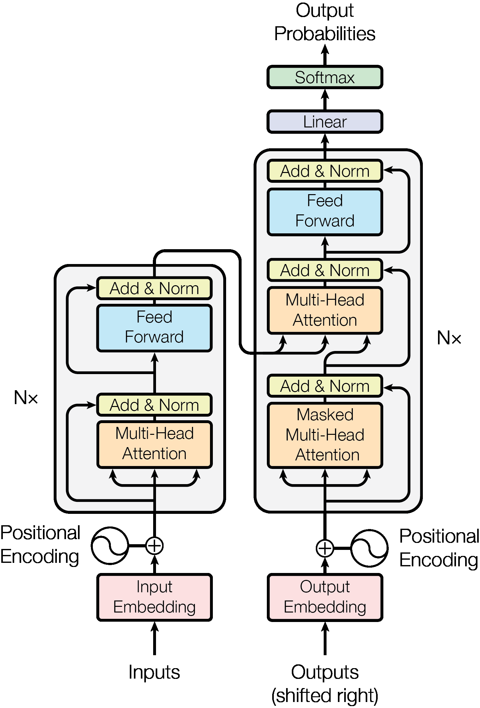

# PDF Image and Drawing Extractor

A Python-based tool for extracting images, diagrams, and drawings from PDF files using multiple extraction methods including PyMuPDF, pdf2image, and OCR.

## Features

- Multiple extraction methods:
  - PyMuPDF for embedded images
  - pdf2image for full page conversion
  - Computer Vision based region detection
  - OCR-based image region detection
- Automatic duplicate image removal
- Support for technical drawings and diagrams
- Text extraction from title blocks

## Installation

### Prerequisites

```bash
# Install system dependencies
sudo apt-get update
sudo apt-get install tesseract-ocr poppler-utils

# Install Python dependencies
pip install -r requirements.txt
```

## Usage

```python
from extract_images import PDFImageExtractor

# Initialize the extractor with your PDF
pdf_path = "assets/NIPS-2017-attention-is-all-you-need-Paper.pdf"
extractor = PDFImageExtractor(pdf_path)

# Extract all images using all methods
extractor.extract_all()

# Or use specific methods
extractor.extract_with_pymupdf()      # For embedded images
extractor.extract_with_pdf2image()    # For full page conversion
extractor.extract_with_ocr()          # For OCR-based detection
```

## Example Results

### Embedded Image Extraction

*Example of an embedded image extracted using PyMuPDF*

### Region Detection

*Example of an embedded image extracted using OpenCV*

### Region Detection

*Example of a region automatically detected using computer vision techniques*

## How It Works

The tool employs three main approaches to extract images:

1. **PyMuPDF Extraction**
   - Extracts embedded images directly from the PDF structure
   - Best for preserving original image quality
   - Handles various image formats (PNG, JPEG, etc.)

2. **PDF2Image Conversion**
   - Converts entire PDF pages to images
   - Applies computer vision to detect distinct regions
   - Uses contour detection to identify potential images/diagrams

3. **OCR-Based Detection**
   - Uses Tesseract OCR to identify text regions
   - Isolates non-text areas as potential images
   - Particularly useful for diagrams and figures

## Contributing

Feel free to submit issues and enhancement requests!

## License

This project is licensed under the MIT License - see the LICENSE file for details.